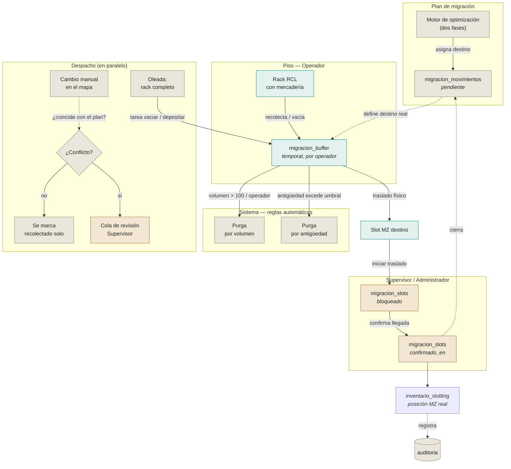

# Migración RCL → MZ — flujo operativo

> Diagrama vivo: se actualiza a medida que el proceso real cambia. Reconstruido a partir de
> `MASTER-PROMPT.md`, `DECISIONES.md` (ADR-015, ADR-017, ADR-020) y `PROGRESO.md` — no es
> una fuente de verdad aparte, es una lectura de esos documentos en forma de diagrama.

Cómo se mueve un artículo desde su posición legacy (`RCL`) hasta su destino en el nuevo
mezanine (`MZ`): el buffer temporal, el bloqueo de slot, la confirmación humana, y dónde se
cruza con Despacho y la detección de conflictos.

## Leyenda

- **Verde (piso):** lo que toca el operador directamente.
- **Beige (sistema):** reglas automáticas, sin intervención humana.
- **Kraft (humano):** requiere aprobación de Supervisor o Administrador.
- Línea sólida = movimiento de datos/estado. Línea punteada = referencia o disparo condicional.

## Notas

- El motor de optimización define el destino **antes** de que el operador toque el rack —
  el buffer nunca es el punto donde se decide a dónde va un artículo.
- Todo artículo en `migracion_buffer` es temporal: sale hacia un slot MZ real, o se purga por
  volumen (`> 100/operador`) o por antigüedad si no avanza (ver ADR-025, hallazgo H2).
- El bloqueo de slot (`migracion_slots.bloqueado`) solo afecta **iniciar traslado** — no
  bloquea otras acciones sobre ese slot (decisión de negocio confirmada en la sesión de F1,
  ver ADR-015).
- La detección de conflicto (ADR-020) es lo que evita que un cambio manual en el mapa quede
  huérfano del plan de migración — antes de esa corrección, un movimiento manual que no
  coincidía con el plan no generaba ningún aviso.
